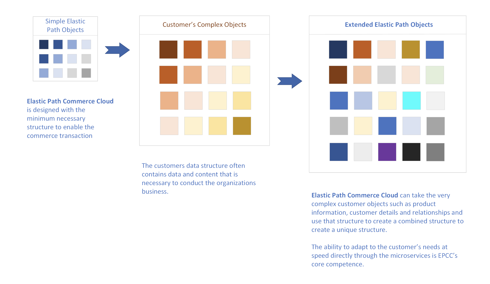

You can define custom data fields for the resources that you use in your store, such as adding more fields to the customer resource. You can also create new resources, such as a wishlist resource to support wishlists in your store. With Flows, you can apply Commerce Cloud to almost any use case.

Flows allow you to create extensive customizations to your Elastic Path Commerce Cloud project, making it a unique solution that meets your business needs.

The platform is based around a collection of different microservices that cover the basics of a commerce platform. Each part of the system is extendable using flows or usable individually as is.

We have ensured that the core concepts are as flexible and extensible as possible, giving you the ability to extend core objects with custom data and create new microservices that stand alone or can be related to other core objects.

### Core vs. non-core Flow

The table below describes main differences between core and non-core Flows.

|Core Flows|	Non-core Flows|
|------------|-----------------|
|Extend an existing resource.|	Create a new resource.|
|Entries managed automatically by Commerce Cloud.|	Need to manually create and manage Entries.|
|Requests are sent to the Fields endpoint.|	Requests are sent to the Entries endpoint.|

### Extend a resource

Extending a resource applies only to core flows. When creating a new flow, make sure the slug matches that of a core resource. For example, *address* object can be extended by creating a flow with slug as *addresses*.

### Add a new resource

Adding a new resource is applicable only to non-core (custom) flows.

### Resource structure

**A Flow** describes a collection of Fields. It is named after the internal entity type you want to associate it with. For example, a Flow with a slug of products applies to all product responses in your store.

**A Field** represents a single field of data (for example a Product Rating) to be applied to an entity. All Fields have a type (string, integer, boolean, date or relationship), a default value, and an optional set of validation rules.

**An Entry** is a specific instance of a Flow, and is associated with a specific instance of an entity (for example, a single product). Use Entries for custom flows (non-core) only. For core flows, these are managed for you.

